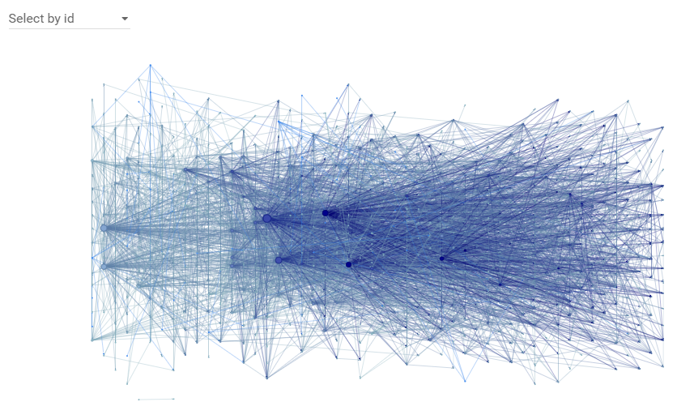
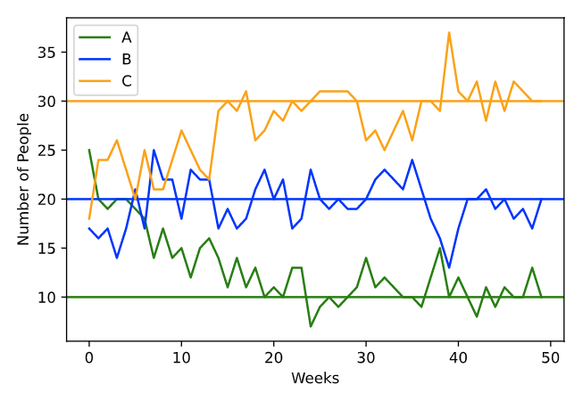
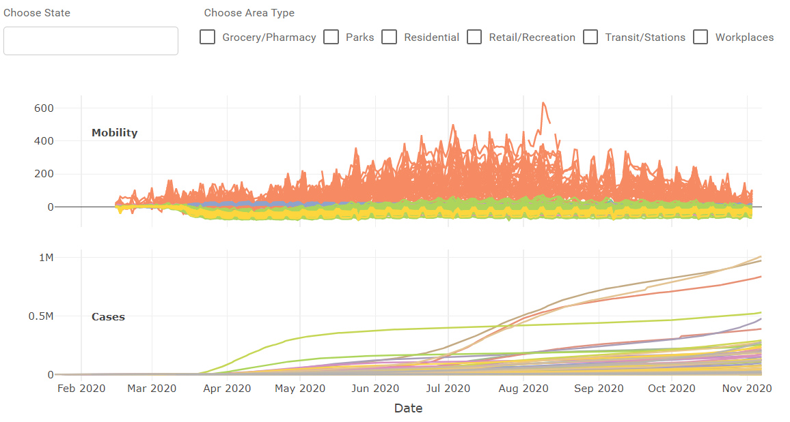

Many of these posts include data visualizations or models. All of the code for these projects can be found at my github account, linked in the header.

### Philosopher Net

[See more...](https://matthewbbone.github.io/matthewbbone/philnetviz.html)

10/15/20

### SFI’s Introduction to Complexity

[See more...](https://matthewbbone.github.io/matthewbbone/complexity.html)

9/12/20

### Numbers don’t Lie… 

[See more...](https://matthewbbone.github.io/matthewbbone/numberslie.html)

6/10/20

### Language Competition: An Abrams-Strogatz inspired agent-based model 

[See more...](https://matthewbbone.github.io/matthewbbone/langcomp.html)

### State Mobility and COVID Cases 

[See more...](https://matthewbbone.github.io/matthewbbone/covid_mobile.html)

6/1/20

