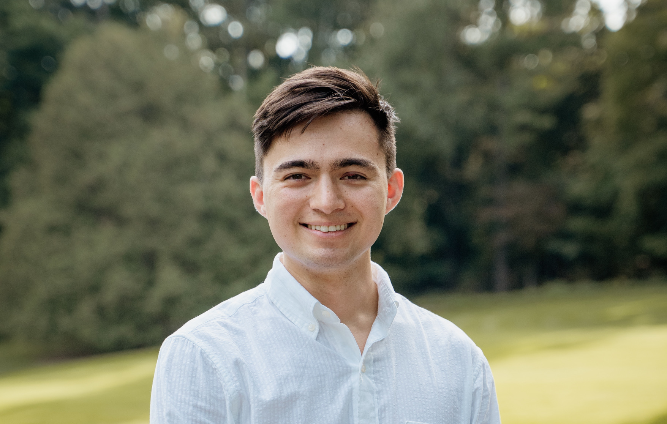

Hello! My name is Matthew Bone, first and foremost, I think of myself as a curious learner with a passion for new ideas and what they can do to improve the world. I'm also a recent graduate of Calvin University with a degree in mathematics and philosophy. In my time as an undergraduate I focused on gaining skills in statistical programming and data science, as well as in understanding discourse ethics and perspectivism. Throughout my time at Calvin I was lucky enough to participate in a wide variety of research projects within domains including public health, news and media, the philosophy of mathematics, and developmental economics. Altogether these experiences enforced my belief in the efficacy of rigorous research and pursuing lower-case truths, while recognizing there's always a new way to understand an old problem. 

When not in the classroom or working on research, I was involved in student organizations such as Rangeela, a cultural performance show, and, most significantly, acting as the co-director of the Calvin Interfaith Alliance. In my time as an interfaith leader on campus, I became passionate about how sharing stories, breaking bread, and learning about others can overcome prejudice and heal divides. This practical experience both informed my study of discourse ethics and perspectivism as well as gave me a cause to champion.

After graduating, I moved to Irvine, CA to work for Capital Group, a large investment management firm, in their technology rotational program. Currently, in my first rotation, I am working for the development engineering team where I am helping to improve the underlying system of the company's technical infrastructure.